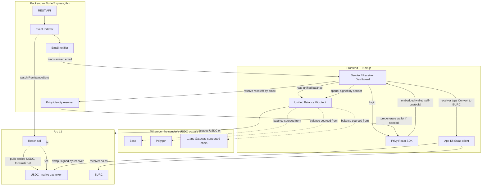
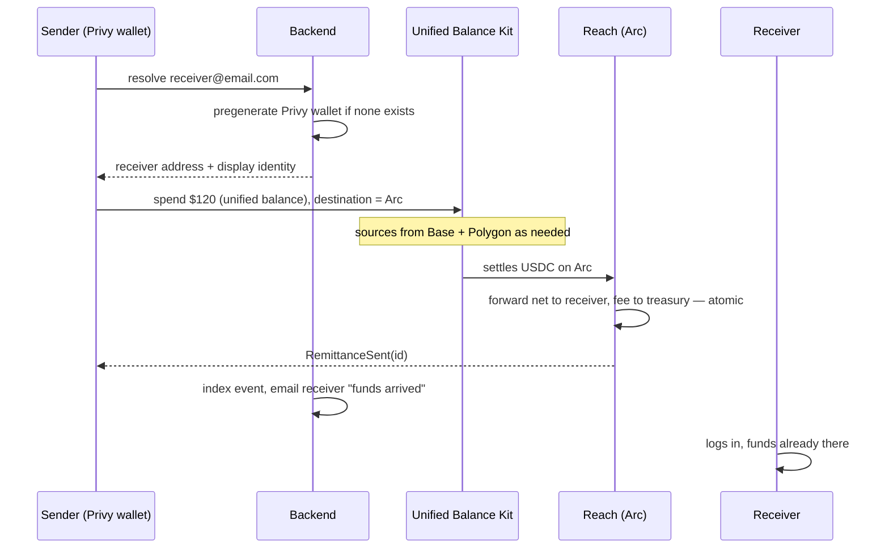

# Reach — Build Plan & System Design

**Send USDC instantly, no matter which chain it's actually sitting on.** A plain remittance app on the surface — sender picks a receiver and an amount, receiver gets money — but built on Circle's **Gateway**, the one Arc-specific mechanic that makes it structurally different from "the same app on any EVM chain."

---

## 0. The Arc-Specific Mechanic This Is Built On

Most people who hold USDC today have it scattered: some got paid on Base, some on Polygon, some on Arbitrum, maybe some already on Arc. Normally, only whichever pile happens to be on the "right" chain is usable right now — moving the rest means bridging, which costs a fee and takes time.

Circle's **Gateway** turns all of that into one balance. Confirmed via research this session: it's live on mainnet across seven chains (Arbitrum, Avalanche, Base, Ethereum, OP Mainnet, Polygon PoS, Unichain) with sub-500ms spend, and **Arc is where Circle explicitly integrates it as a native interoperability primitive** — Arc is the consolidation hub, not just one more chain it happens to support. Circle ships a dedicated SDK for this, **Unified Balance Kit** (part of App Kits), specifically so a developer doesn't have to hand-roll multichain routing.

**Exact live status on Arc testnet is genuinely conflicting, not just vague, as of this plan being written.** Arc's own App Kit docs show a working code sample for Unified Balance Kit targeting `"Arc_Testnet"` as a destination, settling to an arbitrary recipient address. Circle's own official Gateway product page, listing currently supported chains, does **not** include Arc at all (it lists Arbitrum, Avalanche, Base, Ethereum, HyperEVM, OP Mainnet, Polygon PoS, Sei, Solana, Sonic, Unichain, World Chain). Most likely explanation: Arc's team built a first-party Arc-specific integration ahead of or separate from the general Gateway product's chain list — but this can't be confirmed from documentation alone. **Neither doc source should be trusted on its own — the Day 1 spike (§11) must be an actual test call against Arc testnet, not a docs read.**

**The product built on top of it:** the sender never picks a chain. They hit send, and whatever USDC they have — split across two chains, three chains, doesn't matter — gets sourced automatically and lands with the receiver, instantly, settled through Arc.

---

## 1. Differentiation — Why This Is the One

Several directions were explored and dropped earlier in this planning process — a rotating-savings-circle app (turned out to be a well-worn hackathon trope), a stablecoin-payments-plus-lending product for African SMEs (turned out to be the single most actively VC-funded thesis in that exact market, not underserved), and a B2B collateral-pool product (technically sound but too abstract to land as a pitch). The common failure in all three: the differentiation lived in the *business model*, which is easy to accidentally duplicate something that already exists.

This one is different: the differentiation lives in **a specific, verifiable, Arc-only technical capability** (§0), not a clever business idea. The product itself send money, receiver gets it is intentionally the simplest possible thing, because the interesting part isn't the concept, it's that it's genuinely impossible to build the same way on a generic EVM chain. That's a much easier claim to defend under questioning than "nobody's building this," which turned out to be wrong three separate times this session.

---

## 2. Track Fit


| Prize                                                  | Sponsor | What we hit                                                                                                                                                                                       |
| ------------------------------------------------------ | ------- | ------------------------------------------------------------------------------------------------------------------------------------------------------------------------------------------------- |
| Best DeFi/Onchain Finance Application ($1,667)         | Arc     | Real adoption of Arc's own newest infrastructure (Gateway/Unified Balance Kit), multi-step settlement (source across chains → consolidate on Arc → forward to receiver), App Kit usage throughout |
| Launch on Arc Testnet & Push to Mainnet (up to $2,500) | Arc     | A real payment flow shipped using Arc's flagship interoperability feature, deployment-ready by Sep 30                                                                                             |
| Best Financial Flow ($2,500)                           | Privy   | Embedded wallet onboarding + a live send/receive/convert flow                                                                                                                                     |


---

## 3. Scope

**In scope (MVP):**

- Privy login (email/SMS) → embedded wallet, self-custodial. Receiver's wallet exists (pregenerated) even before they've logged in, same pattern as every earlier version of this plan — verify per §11.
- Sender's dashboard shows their USDC balance **as one number**, even though it may be sourced from multiple chains underneath — this single UI decision is the entire product thesis made visible.
- Sender picks a receiver and an amount, hits send. Under the hood: Unified Balance Kit sources the amount from wherever the sender's USDC actually sits, settles to Arc, and a thin router contract on Arc forwards net-of-fee to the receiver.
- Receiver dashboard: USDC balance, one-tap "Convert to EURC" via App Kit Swap — unchanged from every earlier version of this plan.
- The demo's key scene: a sender with USDC split across two chains — neither pile alone covering the amount they want to send — sends it in one action anyway.
- Deployed to Arc testnet; deployment script ready for mainnet cutover.

**Out of scope:**

- Building any bridging or cross-chain logic ourselves — Gateway does that; reimplementing it would be missing the point of the product.
- KYC/compliance, real fiat off-ramp, upgradeable contracts — same reasoning as every earlier version of this plan.
- More than two source chains in the demo — two is enough to prove the mechanic; adding more is polish, not substance.

---

## 4. How It Works, End to End

1. Sender logs in via Privy — embedded wallet, no seed phrase.
2. Their dashboard queries Unified Balance Kit and shows **one USDC number** — say $140, made up of $80 on Base and $60 on Polygon, though nothing in the UI mentions that split unless they dig in.
3. Sender enters a receiver (email — resolved/pregenerated the same way as every earlier version) and an amount — say $120.
4. The app calls Unified Balance Kit to spend $120 against the sender's unified balance, destined for Arc. Gateway sources it from Base and Polygon as needed and settles it on Arc — sub-second, per Circle's own published latency.
5. On Arc, the settled USDC hits `Reach.sol` (unchanged rail design from earlier — see §5), which atomically forwards net-of-fee to the receiver and skims the platform fee, in one transaction.
6. Receiver — who may never have opened the app before — gets an email, logs in, funds are already there. Same "wallet appears the instant money lands" beat as every earlier version, still the strongest emotional moment for the demo.
7. Receiver optionally converts to EURC via App Kit Swap, exactly as designed before.

Nothing about steps 5-7 is new; the only genuinely new piece is step 4, and it's the whole reason this plan exists.

### 4.1 Architecture — Who Talks to What



**How to read this**: Privy owns the wallet layer end to end — both sender and receiver never touch a seed phrase, and the receiver's wallet exists before they've ever logged in (§7). Arc is where money actually lands and where the only real trust/security surface lives — `Reach.sol` is the one contract this product controls. Unified Balance Kit and App Kit Swap are Circle-owned infrastructure this product calls into but doesn't operate — that split matters for the security model (§6): everything this team is responsible for auditing is on the Arc side, in one small contract.

### 4.2 Send Flow — Sequence



---

## 5. Smart Contract Design

`Reach.sol` is written and passing 21 tests (unit + fuzz). It's the atomic push router: pull in, forward net to receiver, fee to treasury, one transaction, nothing left in storage. Function surface, as actually implemented:

**Write**: `send(receiver, amount, maxFeeBps, memo)`, `setTreasury`, `setFeeBps`, `setMinAmount`, `pause`, `unpause`, `rescueTokens(token, to, amount)`.
**Read**: `quote(amount)`, plus standard getters (`token`, `treasury`, `feeBps`, `minAmount`, `hasRole`, `paused`).

Two changes from the earlier plan draft, both found during a full review pass and already fixed in code:
- `send` gained a `maxFeeBps` parameter — the caller's protection against the fee changing between when their wallet displays a quote and when the transaction actually mines. Reverts rather than silently charging more than the sender agreed to.
- `send` now rejects `receiver == address(this)` — previously, sending to the contract's own address (by mistake or a malicious frontend) would leave funds recoverable only via admin-gated `rescueTokens`, turning a user error into something only the admin could fix.

`rescueTokens` exists to recover tokens accidentally sent directly to the contract (a raw wallet transfer bypasses `send` entirely, and this contract has no way to block that). **Flagged, not yet fixed**: it currently has no restriction on rescuing the primary settlement token itself. Safe today, because `send` never leaves a balance in the contract under any current code path — but the moment Gateway settlement wiring lands (open question below), if funds ever land at this address as an intermediate step, `rescueTokens` becomes a way for a compromised admin to sweep real, in-transit user funds. Resolve this when Gateway wiring is designed, not before — the right fix depends on the wiring shape, which isn't decided yet.

The only structural question worth flagging: **does Gateway settle directly to an arbitrary receiver address, or does it need a destination contract to receive and then forward?** If Gateway can target the receiver directly, `Reach` might only be needed for the fee-skim step; if it can only target a contract, `Reach` is the natural landing point — and the `rescueTokens` concern above becomes immediately relevant. Resolve this during the Day 1 spike (§11).

---

## 6. Security Threat Model

Most of this carries over unchanged from the plain push-remittance design (reentrancy, fee-rounding, admin-key, pause-can't-trap-funds — same reasoning as before, not re-derived here). What's genuinely new with Gateway in the picture:


| #   | Threat                                                                                                   | Vector                                                                                                                                                                                                          | Mitigation                                                                                                                                                                                                                                         |
| --- | -------------------------------------------------------------------------------------------------------- | --------------------------------------------------------------------------------------------------------------------------------------------------------------------------------------------------------------- | -------------------------------------------------------------------------------------------------------------------------------------------------------------------------------------------------------------------------------------------------- |
| 1   | Gateway sourcing fails partway (e.g., one of the two source chains is unavailable)                       | Network issue on one of the source chains                                                                                                                                                                       | This should fail the whole send atomically, not partially — confirm this is Gateway's actual behavior during the Day 1 spike rather than assuming it; if it can partially succeed, that's a real problem to design around before building the rest |
| 2   | Sender's displayed "unified balance" is stale relative to what Gateway can actually source in the moment | A source chain's balance changed between the UI reading it and the send executing                                                                                                                               | Re-check available balance immediately before submitting the send, not just on page load; treat the UI number as informational, the actual spend call as the source of truth                                                                       |
| 3   | Attestation/signature trust in Gateway's off-chain component                                             | Gateway's architecture combines on-chain contracts with an off-chain attestation service (confirmed via research) — that attestation service is a trust dependency this product inherits, not one it can remove | This is Circle's infrastructure to secure, not this product's — but it's honest to name it explicitly rather than pretend the whole flow is trustless just because the settlement leg is                                                           |
| 4   | Fee taken twice (once implicitly by Gateway, once by `Reach`)                                    | Gateway's own fee structure (confirmed to exist, exact mechanics unverified) stacking with this product's fee                                                                                                   | Surface Gateway's fee to the sender transparently before they confirm a send — don't let the receiver be surprised by a smaller net amount than expected                                                                                           |


Everything else — reentrancy, CEI discipline, admin multisig, pause behavior — is identical to the threat table already built out in earlier versions of this plan; not repeated here to keep this version focused on what's actually new.

---

## 7. Privy Integration Design

Unchanged from earlier versions: email/SMS login, no seed phrase, pregenerated receiver wallets (verify per §11), a spend-limit policy on the sender's embedded wallet as defense-in-depth given sends are irreversible once broadcast. Nothing about Gateway changes how Privy fits — it's still the wallet layer underneath everything.

---

## 8. Tech Stack


| Layer          | Choice                                      | Why                                                                           |
| -------------- | ------------------------------------------- | ----------------------------------------------------------------------------- |
| Contracts      | Solidity 0.8.24, Foundry                    | Unchanged reasoning from earlier versions                                     |
| New dependency | Circle's **Unified Balance Kit** (App Kits) | The actual differentiator — this is the one new integration this version adds |
| Frontend       | Next.js + Privy React SDK + wagmi/viem      | Unchanged                                                                     |
| Backend        | Node + Express, thin                        | Indexer, identity resolution, notifier — unchanged role                       |
| Chain          | Arc testnet → mainnet                       | Unchanged                                                                     |


---

## 9. Repo Structure

```text
reach/
├── contracts/
│   ├── src/Reach.sol
│   ├── test/Reach.t.sol
│   ├── script/Deploy.s.sol
│   └── foundry.toml
├── backend/
│   ├── src/indexer.ts
│   ├── src/identity.ts
│   └── src/api.ts
├── frontend/
│   ├── app/
│   └── lib/privy.ts, lib/contract.ts, lib/unifiedBalance.ts, lib/appKitSwap.ts
├── docs/
│   └── architecture.png
└── README.md
```

---

## 10. Build Timeline — Sequenced So There's Always a Finishable Product

Given §0's genuinely conflicting evidence on Gateway's Arc status, **the build order deliberately does not gamble the whole submission on it.** The core product (plain send, receiver gets it, works exactly like the earlier fully-specified push-remittance design) gets built and finished *first*, on its own, fully solid and submittable. Gateway is attempted *after*, inside a hard time-box, as an enhancement layered on top — if it doesn't pan out, it gets cut and the submission is still complete, not half-broken.

**Day 1 — The guaranteed core, no unverified dependencies**

- `Reach.sol` — the atomic push router, unchanged design from earlier in this plan. Deploy to Arc testnet.
- Privy login + embedded wallets, sender and receiver flows wired end to end on plain USDC.
- App Kit Swap "Convert to EURC" on the receiver side — this one *is* already confirmed working on Arc testnet (verified earlier in this planning process), so it's safe to build on directly, unlike Gateway.
- **By end of Day 1, there is a complete, working, demoable product, independent of anything in §0.** This is the checkpoint that matters most.

**Day 2 — Time-boxed Gateway attempt (max ~4 hours), then polish either way**

- Spend a hard-capped block of time on the real test call from §11 — actually try Unified Balance Kit against Arc testnet with a genuine cross-chain source balance.
- **If it works** within the time-box: wire it in as the send-flow's sourcing step, ahead of `Reach`.
- **If it doesn't work by the cutoff**: stop, don't chase it further, spend the rest of Day 2 hardening and polishing the guaranteed core instead (Privy spend-limit policy, pregenerated-wallet flow, dashboard polish, tests).
- This decision point is explicit and time-boxed on purpose — the failure mode this avoids is "one more hour and I'll get it working," repeated until there's no time left for anything else.

**Day 3 — Demo + submission, same either way**

- If Gateway landed: build the "$80 here, $60 there, sent as $120 in one tap" demo scene.
- If it didn't: demo the guaranteed core — sender sends, receiver's wallet appears the instant money lands, optional EURC conversion — which is still a complete, working, honest submission on its own, and say plainly in the write-up that Gateway integration was attempted and the reason it was cut.
- Architecture diagram, README, video, mainnet deploy script dry-run — unchanged either way.

**The actual answer to "what if we can't finish it": we're never building something whose only value depends on the risky part landing. The core has real value — a working push-remittance app with Privy onboarding and multi-currency conversion — with or without Gateway.**

---

## 11. Open Questions — Verify Before/During Build

- **Highest priority**: Gateway/Unified Balance Kit's actual live status on Arc testnet — Arc's App Kit docs show a working `Arc_Testnet` code sample, but Circle's own Gateway product page's current supported-chains list omits Arc entirely (§0). Resolve this with a real test call, not another docs read.
- Does Gateway settle to an arbitrary address or only to a contract (§5)?
- Does a sourcing failure on one chain fail the whole send atomically, or can it partially succeed (§6 #1)?
- What fee, if any, Gateway itself charges, and how it's surfaced (§6 #4).
- Privy pregenerated-wallet capability — unchanged from every earlier version of this plan.
- App Kit `Swap` custody model — unchanged from every earlier version of this plan.

---

## 12. Non-Security Risks


| Risk                                                                                        | Mitigation                                                                                                                                                  |
| ------------------------------------------------------------------------------------------- | ----------------------------------------------------------------------------------------------------------------------------------------------------------- |
| Gateway isn't actually usable on Arc testnet yet                                            | This is the single biggest risk in this version of the plan — resolve it Day 1, with the plain push-remittance design as a real, ready fallback             |
| Demo's two-source-chain scenario is fiddly to set up (funding a wallet across two testnets) | Script it once, reliably, well before recording — this is exactly the kind of thing that breaks live if rehearsed only once                                 |
| Judges don't immediately grasp why "one balance across chains" matters                      | Open the demo by showing the fragmented balance first, explicitly, before showing it get sent as one — the contrast has to be on screen, not just described |


