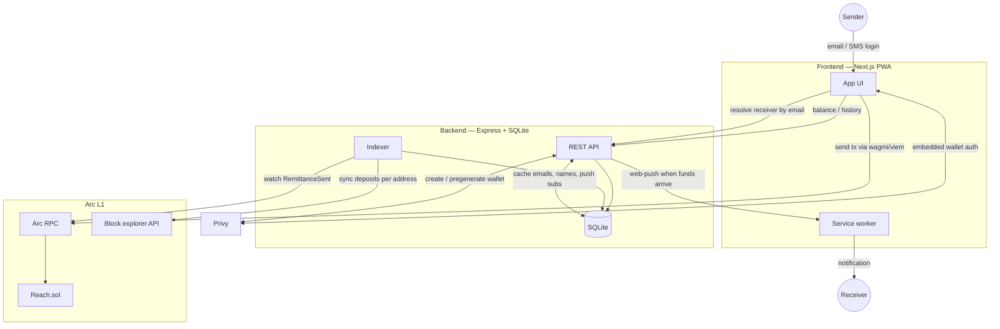

# Reach

Send USDC or EURC to anyone by email, instantly, with no seed phrase and no bridging-for-gas step. Built on Circle's Arc L1 (USDC is the native gas token, so there's nothing to "top up" before you can send) and Privy (email login creates a real embedded wallet in the background the user never sees a seed phrase or an extension prompt).

The part that makes it more than a wallet demo: you can send to an email that has never touched Reach before. The backend pregenerates a real wallet for that email through Privy the moment someone sends to it, so funds are waiting there before the recipient ever signs up.

**Live**
- App: https://reach-send.vercel.app
- Backend: https://reach-dkiq.onrender.com
- Contract (Arc testnet, verified): https://testnet.arcscan.app/address/0x75E4Eb5F40c48e89e0FDA6e32E88459F5d97183D

## What's here

- **`contracts/`** — `Reach.sol`, the payment router. `send()` pulls the sender's chosen token (USDC or EURC, admin-managed allowlist) and forwards net-of-fee straight to the receiver in one transaction, no escrow, no claim step, nothing held in contract storage between sends. 30 Foundry tests (unit + fuzz).
- **`backend/`** — Express + SQLite. Indexes the contract's `RemittanceSent` events, resolves an email to a wallet address via Privy (creating a pregenerated wallet if the email is new), and sends web-push notifications when funds arrive.
- **`frontend/`** — Next.js 16 PWA. Privy login, send/receive flow, transaction history, push notifications, installable to a home screen.

## How a send actually works

1. Sender logs in with email or SMS. Privy creates a real embedded wallet in the background, no seed phrase shown, no browser extension needed.
2. Sender picks USDC or EURC, an amount, and types the receiver's email.
3. The backend resolves that email to a wallet address. If it's never been seen before, Privy creates (pregenerates) a wallet for it right then, the receiver doesn't need to have signed up yet.
4. Sender confirms once (amount, fee, what the receiver actually gets) and sends. The contract's own `quote()` is what computes the fee shown, the frontend never reimplements that math itself.
5. `Reach.sol` pulls the tokens and forwards net-of-fee to the receiver in one transaction. Since USDC is Arc's native gas token, there's no separate "get gas first" step.
6. If the receiver has push notifications enabled, they get a notification the moment funds land. If they've never opened the app, the funds are already sitting in their wallet the first time they do.

## Architecture



The frontend never talks to the backend to move funds — sending is always a direct wallet transaction against `Reach.sol` over Arc's RPC. The backend's job is everything around that: resolving an email to an address (creating one if it doesn't exist yet), keeping a queryable history that merges the contract's own events with plain deposits, and notifying a receiver when something lands.

## Contracts

```bash
cd contracts
forge build
forge test
```

`script/Deploy.s.sol` reads its config from environment variables so the same script runs unchanged against testnet or mainnet:

| Env var | Purpose |
| --- | --- |
| `USDC_ADDRESS` | Arc USDC address (`0x3600000000000000000000000000000000000000` on testnet) |
| `EURC_ADDRESS` | Arc EURC address (`0x89B50855Aa3bE2F677cD6303Cec089B5F319D72a` on testnet) |
| `TREASURY_ADDRESS` | Where protocol fees go |
| `ADMIN_ADDRESS` | Should be a multisig, not an EOA, before any real deployment |
| `FEE_BPS` | Optional, defaults to 50 (0.50%) |
| `MIN_AMOUNT` | Optional, defaults to `1e6` ($1-equivalent) |

The private key is deliberately not one of the env vars — supply it only at deploy time, never persisted to disk:

```bash
source .env  # loads USDC_ADDRESS, EURC_ADDRESS, TREASURY_ADDRESS, ADMIN_ADDRESS, etc.
forge script script/Deploy.s.sol --rpc-url https://rpc.testnet.arc.io --broadcast --interactive
```

`--interactive` prompts for the private key at runtime — it's never written to a file or shell history. For repeated deploys, `cast wallet import <name> --interactive` once to create a local encrypted keystore, then use `--account <name>` instead of `--interactive` on future runs.

Arc testnet: chain ID `5042002`, faucet at `faucet.circle.com`, explorer at `testnet.arcscan.app`.

### Deployed (Arc testnet)

| | |
| --- | --- |
| Address | `[0x75E4Eb5F40c48e89e0FDA6e32E88459F5d97183D](https://testnet.arcscan.app/address/0x75E4Eb5F40c48e89e0FDA6e32E88459F5d97183D)` |
| Status | Verified on Blockscout |
| Allowed tokens | USDC, EURC |
| Fee | 0.50% |
| Min send | $1-equivalent |

## Backend

```bash
cd backend
npm install
cp .env.example .env   # fill in real values
npm run dev             # tsx watch, http://localhost:4021
```

`npm run build && npm start` for a production run (compiles to `dist/` first).

| Env var | Purpose |
| --- | --- |
| `RPC_URL` | Arc RPC endpoint |
| `REACH_ADDRESS` | Deployed contract address |
| `REACH_DEPLOY_BLOCK` | Block to start indexing from |
| `USDC_ADDRESS` / `EURC_ADDRESS` | Token addresses |
| `PRIVY_APP_ID` / `PRIVY_APP_SECRET` | From the Privy dashboard |
| `VAPID_PUBLIC_KEY` / `VAPID_PRIVATE_KEY` / `VAPID_SUBJECT` | Generate with `npx web-push generate-vapid-keys` |
| `CORS_ORIGIN` | The deployed frontend's origin |
| `PORT` | Defaults to 4021 locally; a host like Render injects its own |
| `DB_PATH` | SQLite file path, defaults to `reach.sqlite` |

Deployed on Render — see `render.yaml` for the exact build/start config.

## Frontend

```bash
cd frontend
npm install
cp .env.local.example .env.local   # fill in real values
npm run dev   # http://localhost:3000
```

| Env var | Purpose |
| --- | --- |
| `NEXT_PUBLIC_PRIVY_APP_ID` | From the Privy dashboard |
| `NEXT_PUBLIC_RPC_URL` | Arc RPC endpoint |
| `NEXT_PUBLIC_REACH_ADDRESS` / `NEXT_PUBLIC_USDC_ADDRESS` / `NEXT_PUBLIC_EURC_ADDRESS` | Contract/token addresses |
| `NEXT_PUBLIC_API_URL` | The backend's URL |
| `NEXT_PUBLIC_VAPID_PUBLIC_KEY` | Same VAPID keypair as the backend |

Deployed on Vercel, with its Root Directory set to `frontend`.

## Status

Contract deployed and verified on Arc testnet. Backend and frontend built and deployed. Core flow email login, send by email (including to a never-before-seen recipient), transaction history, push notifications on arrival works end to end.
